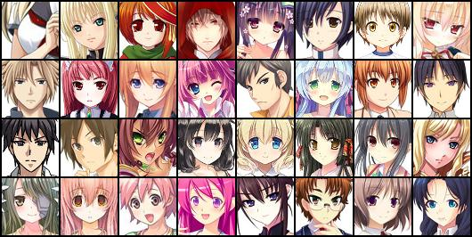
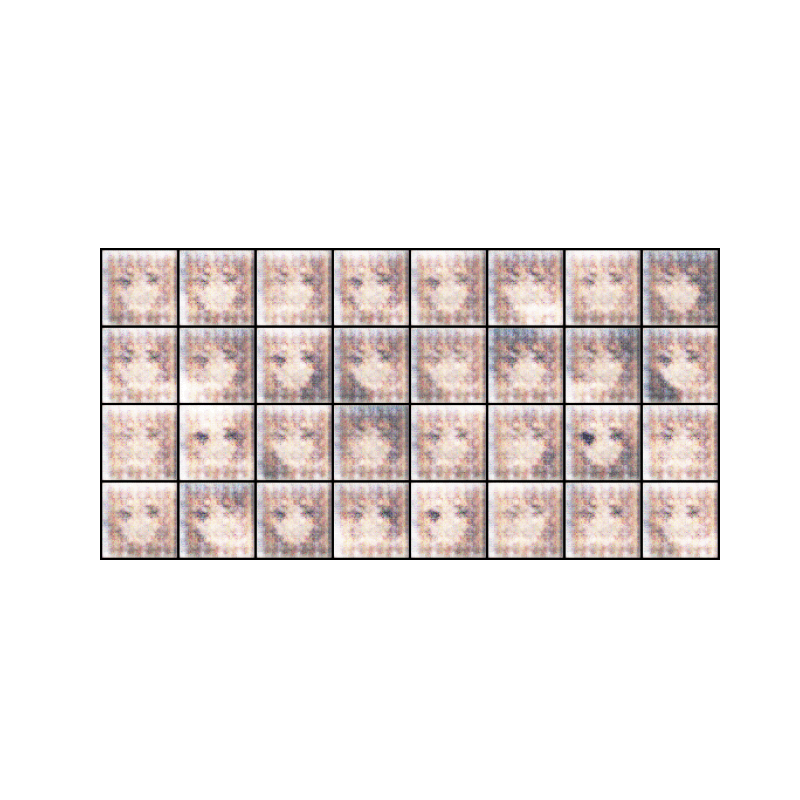
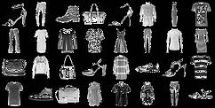
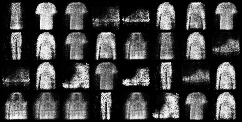

# Pytorch-Generate-Anime-Faces-using-GAN-Model

- GAN (Generative Adversarial Network) is a deep learning framework consisting of two neural networks: the generator and the discriminator. The goal of GAN is to generate new data that resembles a given training dataset. The generator learns to create synthetic data samples, such as images or text, while the discriminator learns to distinguish between the real and generated data.

# Deep Convolutional GAN
- DC GAN:
  

- Sample: https://www.kaggle.com/datasets/soumikrakshit/anime-faces

- 100 epochs

# Conditional GAN
- C-GAN

- Sample: Fashion MNIST

- 100 epochs:

