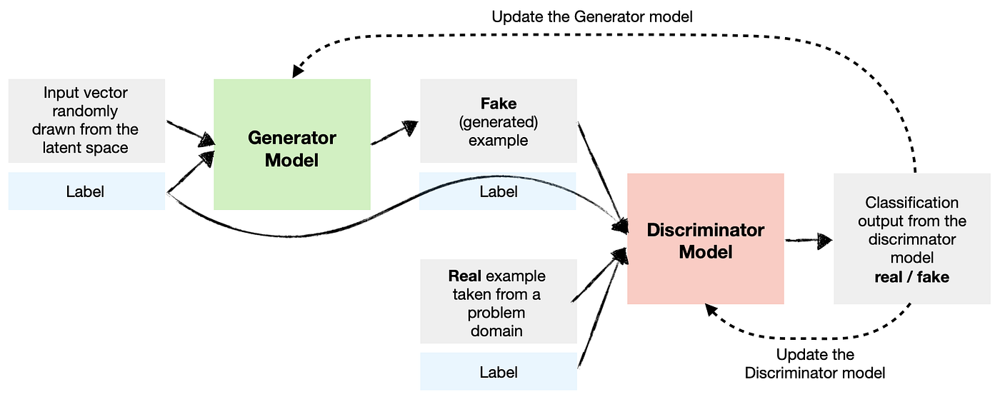

# Pytorch-Generative-Adversarial-Network

- GAN (Generative Adversarial Network) is a deep learning framework consisting of two neural networks: the generator and the discriminator. The goal of GAN is to generate new data that resembles a given training dataset. The generator learns to create synthetic data samples, such as images or text, while the discriminator learns to distinguish between the real and generated data.

# Deep Convolutional GAN
- DC GAN flowchart (The image is used from Medium: GAN — A comprehensive review into the gangsters of GANs):
  

- Sample: https://www.kaggle.com/datasets/soumikrakshit/anime-faces

- 100 epochs:

# Wasserstein GAN With Gradient Penalty
- W-gan-gp flowchart(The image is used from Medium: GAN — Wasserstein GAN & WGAN-GP):

- Sample: https://www.kaggle.com/datasets/soumikrakshit/anime-faces

- 100 epochs:

- 200 epochs:

# Conditional GAN
- C-GAN flowchart (The image is used from Towards data science - cGAN: Conditional Generative Adversarial Network)

- Sample: Fashion MNIST

- 100 epochs:

# Pix2Pix: Image-to-image translation with a conditional GAN
- pix2pix GAN flowchart (The image is used from Neurohive: Image-to-Image Translation Neural Network): 

- pix2pix GAN architecture (The image is used from ResearchGate: Exploring sequence transformation in magnetic resonance imaging via deep learning using data from a single asymptomatic patient):

- Sample: https://www.kaggle.com/datasets/splcher/animefacedataset

- 80 epochs:

